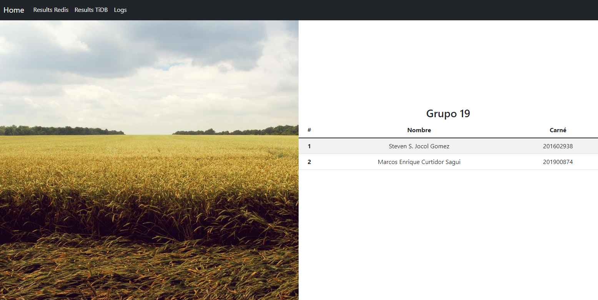
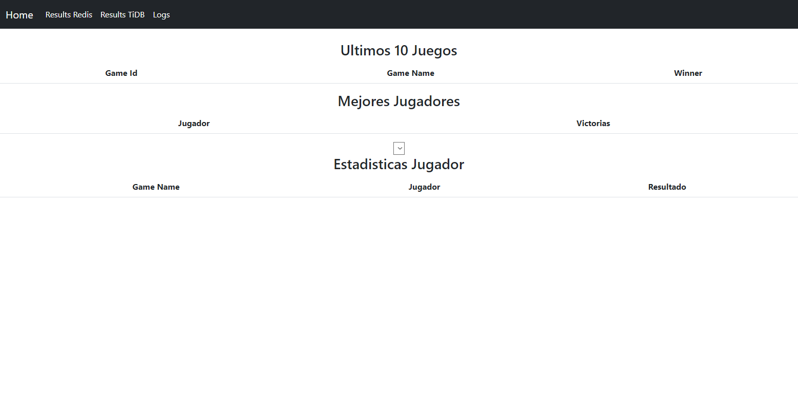
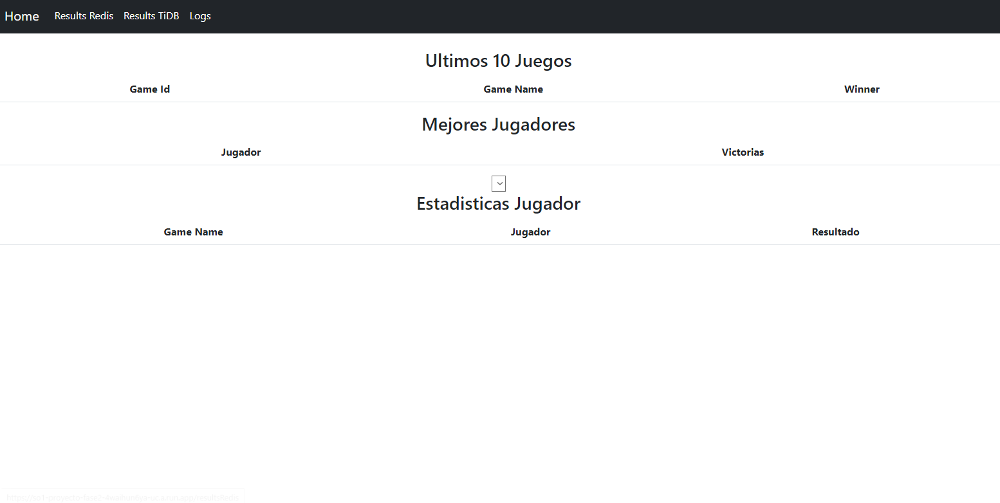
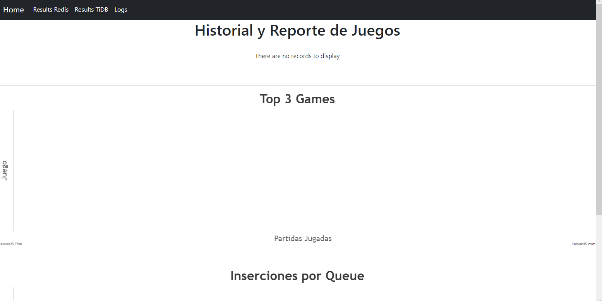

# SO1 Proyecto Fase 2

El siguiente proyecto es un simulador de juegos.

Permite visualizar los resultados que se obtienen de los juegos y los logs para visualizar por cual de las rutas fue ejecutado el juego.

Esto lo realiza a traves de dos rutas, mediante locust se genera el trafico, donde el trafico seran una serie de juegos para ir ejecutando en dos rutas que se iran definiendo segun un balanceador de carga y enviar esa informacion hacia las bases de datos

Para acceder a estos reportes se utiliza un portal web:

### Reporte de [Redis](https://so1-proyecto-fase2-4waihun6ya-uc.a.run.app/resultsRedis): 
La informacion se obtiene cada vez que se accede a la pagina, donde podremos visualizar los ultimos 10 juegos que han sido ejecutados, los mejores jugadores que seran quienes han ganado mas juegos y por ultimo las estadisticas de un jugador en especifico donde se podra ver si ha ganado o perdido en todos los juegos ejecutados.

Todos estos reportes se obtienen de la base de datos Redis que se encuentra en una instancia de Compute Engine.

### Reporte de [TiDB](https://so1-proyecto-fase2-4waihun6ya-uc.a.run.app/resultsTiDB): 
La informacion se obtiene cada vez que se accede a la pagina, donde podremos visualizar los ultimos 10 juegos que han sido ejecutados, los mejores jugadores que seran quienes han ganado mas juegos y por ultimo las estadisticas de un jugador en especifico donde se podra ver si ha ganado o perdido en todos los juegos ejecutados.

Todos estos reportes se obtienen de la base de datos TiDB que se encuentra en una instancia de Compute Engine.

### Historial o [Logs](https://so1-proyecto-fase2-4waihun6ya-uc.a.run.app/logs): 
Cada solicitud de los juegos ejecutados se ira por diferente ruta, por lo cual para poder saber por que ruta se ha simulado un juego se podra visualizar de manera grafica por cual de las rutas se ha dirigido la peticion, junto con mas informacion que puede ser de utilidad.

